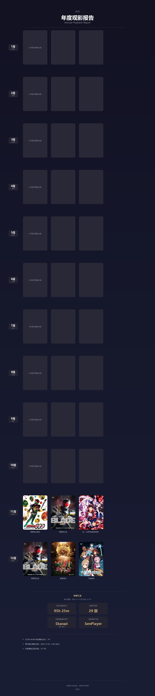

# Jellyfin Playback Report

**Jellyfin 播放周榜 & 年度观影报告生成器**

自动统计 Jellyfin 媒体服务器的播放数据，生成精美的可视化海报。支持与 MoviePilot 订阅日历联动。

## 海报预览

### 播放周榜 V3（含订阅日历）


### 播放周榜 V2


### 年度观影报告


## 功能特性

### 📊 播放周榜 V3 (Weekly Report with Calendar) `NEW`
- 统计每周播放 Top 3（电影 / 电视剧 / 番剧）
- **本周放送日历**：集成 MoviePilot 订阅数据
  - 横向 7 列布局（周一至周日）
  - 显示剧集封面、剧名、季号集数
  - 自动获取 TMDB 海报
- 自动识别内容类型并分类
- 统计本周片王
- 支持推送到 Server 酱 / 上传图床

### 📊 播放周榜 V2 (Weekly Report)
- 统计每周播放 Top 3（电影 / 电视剧 / 番剧）
- 自动识别内容类型并分类
- 统计本周片王（观看时长最长的用户）
- 三列等权栅格布局，Apple 设计风格
- 支持推送到 Server 酱 / 上传图床

### 🎬 年度观影报告 (Annual Report)
- 按月统计 Top 3 观看内容（不区分类别）
- 年度汇总：总播放时长、观看作品数
- 年度观看最长用户、最常用客户端
- 补充数据：夜间观影占比、单日最长记录等
- 深色背景、低饱和、克制的设计风格

## 安装

```bash
# 克隆仓库
git clone https://github.com/zzstar101/jellyfin-playback-report.git
cd jellyfin-playback-report

# 安装依赖
pip install pillow requests paramiko
```

## 配置

编辑脚本中的配置区：

### weekly_rank_v3.py（推荐）

```python
# NAS SSH 配置（用于拉取 Jellyfin 播放记录数据库）
NAS_HOST = "YOUR_NAS_HOST"
NAS_PORT = 22
NAS_USER = "YOUR_NAS_USER"
NAS_PASSWORD = "YOUR_NAS_PASSWORD"
NAS_DB_PATH = "/path/to/playback_reporting.db"

# Jellyfin 服务器
JELLYFIN_URL = "https://your-jellyfin-server.com"
JELLYFIN_API_KEY = "YOUR_API_KEY"

# MoviePilot 配置（用于订阅日历功能）
MOVIEPILOT_URL = "https://your-moviepilot-server.com"
MOVIEPILOT_API_TOKEN = "YOUR_MOVIEPILOT_API_TOKEN"
MOVIEPILOT_USERNAME = "YOUR_USERNAME"
MOVIEPILOT_PASSWORD = "YOUR_PASSWORD"

# 媒体库父项 ID（用于区分番剧和电视剧）
LIBRARY_ANIME = "YOUR_ANIME_LIBRARY_ID"
LIBRARY_TV = "YOUR_TV_LIBRARY_ID"

# 站点名称（显示在海报上）
SITE_NAME = "YOUR_SITE_NAME"

# Server 酱推送（可选）
SERVERCHAN_KEY = "YOUR_SERVERCHAN_KEY"

# Lsky 图床（可选）
LSKY_URL = "https://your-lsky-server.com"
LSKY_TOKEN = "YOUR_LSKY_TOKEN"
```

### weekly_rank_v2.py

```python
# NAS SSH 配置（用于拉取 Jellyfin 播放记录数据库）
NAS_HOST = "YOUR_NAS_HOST"
NAS_PORT = 22
NAS_USER = "YOUR_NAS_USER"
NAS_PASSWORD = "YOUR_NAS_PASSWORD"
NAS_DB_PATH = "/path/to/playback_reporting.db"

# Jellyfin 服务器
JELLYFIN_URL = "https://your-jellyfin-server.com"
JELLYFIN_API_KEY = "YOUR_API_KEY"

# 站点名称（显示在海报上）
SITE_NAME = "YOUR_SITE_NAME"

# Server 酱推送（可选）
SERVERCHAN_KEY = "YOUR_SERVERCHAN_KEY"

# Lsky 图床（可选）
LSKY_URL = "https://your-lsky-server.com"
LSKY_TOKEN = "YOUR_LSKY_TOKEN"
```

### annual_report.py

```python
# 报告年份
REPORT_YEAR = 2025

# Jellyfin 服务器
JELLYFIN_URL = "https://your-jellyfin-server.com"
JELLYFIN_API_KEY = "YOUR_API_KEY"

# 站点名称
SITE_NAME = "YOUR_SITE_NAME"
```

### 字体配置

根据操作系统修改字体路径：

- **Windows**: `C:/Windows/Fonts/msyh.ttc`
- **Linux**: `/usr/share/fonts/truetype/wqy/wqy-microhei.ttc`

## 使用

### 生成周榜（V3 含日历）

```bash
python weekly_rank_v3.py
```

### 生成周榜（V2）

```bash
python weekly_rank_v2.py
```

### 生成年度报告

```bash
# 先运行周榜脚本拉取数据库
python weekly_rank_v2.py

# 再生成年度报告
python annual_report.py
```

## 自动化运行

### Windows 计划任务

```powershell
$action = New-ScheduledTaskAction -Execute "python" -Argument "weekly_rank_v2.py" -WorkingDirectory "C:\path\to\project"
$trigger = New-ScheduledTaskTrigger -Weekly -DaysOfWeek Monday -At 10:00
Register-ScheduledTask -TaskName "Jellyfin Weekly Report" -Action $action -Trigger $trigger
```

### Linux Cron

```bash
# 每周一 10:00 运行（V3）
0 10 * * 1 cd /path/to/project && /usr/bin/python3 weekly_rank_v3.py >> cron.log 2>&1

# 或使用 V2
0 10 * * 1 cd /path/to/project && /usr/bin/python3 weekly_rank_v2.py >> cron.log 2>&1
```

## 数据来源

本项目依赖以下服务：

### Jellyfin Playback Reporting 插件
1. 在 Jellyfin 安装 [Playback Reporting](https://github.com/jellyfin/jellyfin-plugin-playbackreporting) 插件
2. 数据库通常位于：`{Jellyfin配置目录}/data/playback_reporting.db`

### MoviePilot（可选，用于订阅日历）
V3 版本支持从 [MoviePilot](https://github.com/jxxghp/MoviePilot) 获取订阅信息，显示本周待播剧集日历。

## 依赖

- Python 3.8+
- Pillow (图像处理)
- requests (HTTP 请求)
- paramiko (SSH 连接，可选)

## License

MIT License
